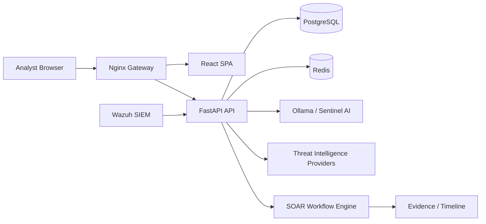
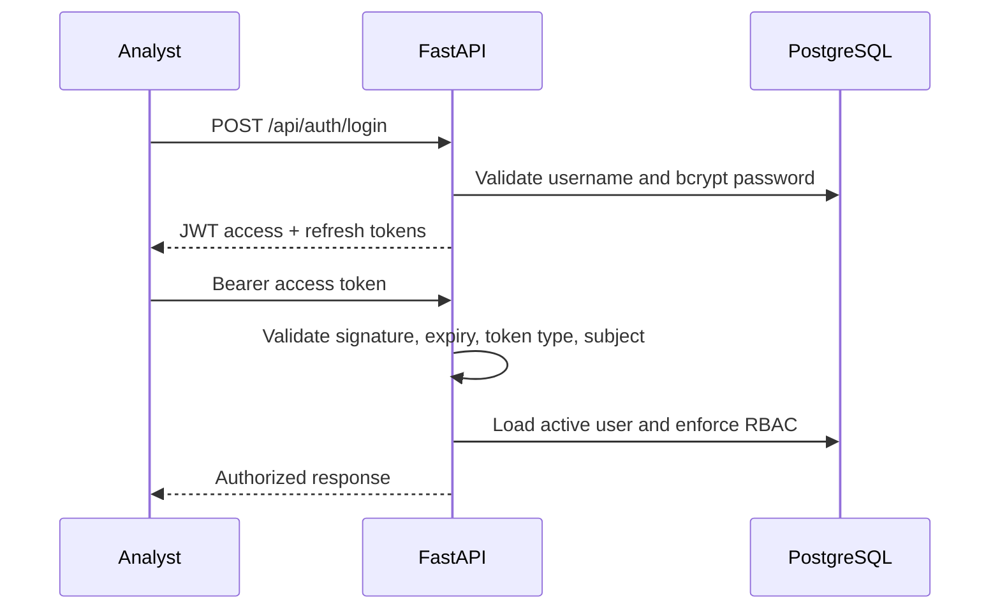
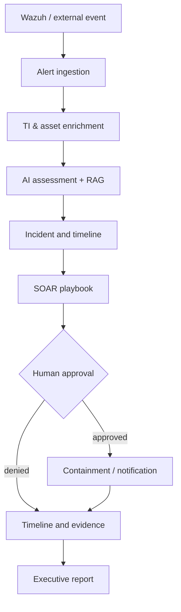
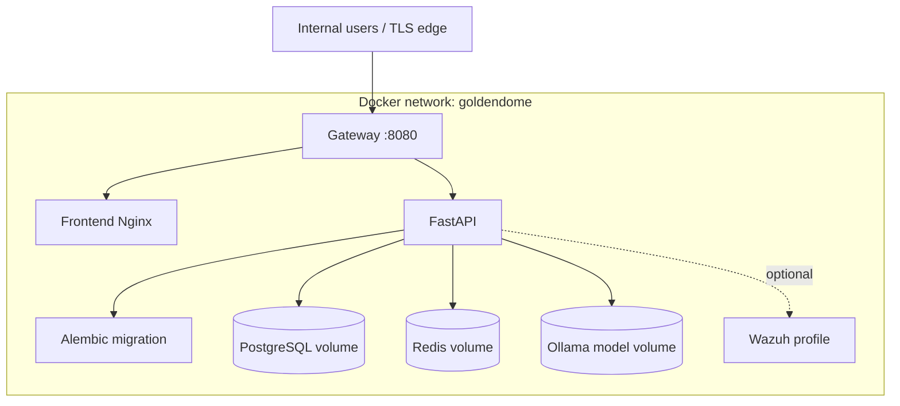

# RC1 Architecture Diagrams

## Overall system

```mermaid
flowchart LR
  Analyst[Analyst Browser] --> Gateway[Nginx Gateway]
  Gateway --> Frontend[React SPA]
  Gateway --> API[FastAPI API]
  API --> DB[(PostgreSQL)]
  API --> Cache[(Redis)]
  API --> AI[Ollama / Sentinel AI]
  API --> TI[Threat Intelligence Providers]
  Wazuh[Wazuh SIEM] --> API
  API --> SOAR[SOAR Workflow Engine]
  SOAR --> Evidence[Evidence / Timeline]
```

## Authentication flow

```mermaid
sequenceDiagram
  participant U as Analyst
  participant A as FastAPI
  participant D as PostgreSQL
  U->>A: POST /api/auth/login
  A->>D: Validate username and bcrypt password
  A-->>U: JWT access + refresh tokens
  U->>A: Bearer access token
  A->>A: Validate signature, expiry, token type, subject
  A->>D: Load active user and enforce RBAC
  A-->>U: Authorized response
```

## Detection-to-response flow

```mermaid
flowchart TD
  Event[Wazuh / external event] --> Alert[Alert ingestion]
  Alert --> Enrich[TI & asset enrichment]
  Enrich --> AI[AI assessment + RAG]
  AI --> Incident[Incident and timeline]
  Incident --> Playbook[SOAR playbook]
  Playbook --> Approval{Human approval}
  Approval -->|approved| Response[Containment / notification]
  Approval -->|denied| Audit[Timeline and evidence]
  Response --> Audit
  Audit --> Report[Executive report]
```

## Deployment topology

```mermaid
flowchart TB
  Internet[Internal users / TLS edge] --> Gateway[Gateway :8080]
  subgraph Docker network: goldendome
    Gateway --> Frontend[Frontend Nginx]
    Gateway --> Backend[FastAPI]
    Backend --> Migrate[Alembic migration]
    Backend --> DB[(PostgreSQL volume)]
    Backend --> Redis[(Redis volume)]
    Backend --> Ollama[(Ollama model volume)]
    Backend -. optional .-> Wazuh[Wazuh profile]
  end
```
